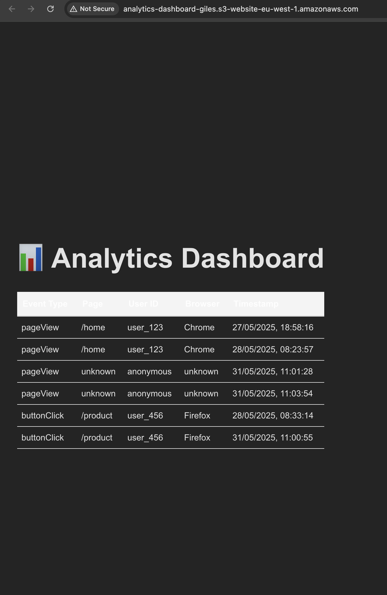
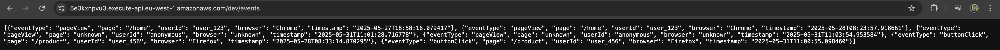

# 📊 Serverless Analytics Dashboard (AWS + React)

A fully functional serverless analytics dashboard built with:

- **Frontend**: React + Vite
- **Backend**: AWS Lambda + API Gateway + DynamoDB
- **Hosting**: S3 static website hosting

---

## 🖼️ Screenshots




---

## 🚀 Features

- Submit analytics events via POST
- Store event data in DynamoDB via Lambda
- View results on a React dashboard
- Hosted on S3 as a static website

---

## 🧱 Technologies

| Layer      | Tech                          |
|------------|-------------------------------|
| Frontend   | React + Vite                  |
| Backend    | AWS Lambda (Python)           |
| API        | API Gateway                   |
| Storage    | DynamoDB                      |
| Hosting    | S3 Static Website             |

---

## 🔧 Local Development

### Frontend

```bash
cd analytics-dashboard
npm install
npm run dev
